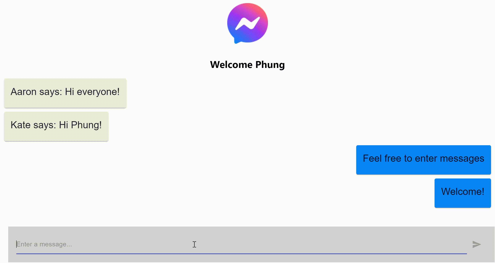

# Project Description
## [Messenger Clone web app](https://messenger-clone-5e588.web.app/)

This web app attempts to replicate the front-end web page of the [Facebook messenger app](https://www.messenger.com/). The web app allows users to type, send, and view their messages as well as other users' messages.

The messenger clone web app is viewable at: https://messenger-clone-5e588.web.app/ 

## Technical Description
This project was bootstrapped with [Create React App](https://github.com/facebook/create-react-app) and uses [Material UI](https://material-ui.com/) to design React components.
This project is deployed with [Firebase](https://firebase.google.com/) and uses Cloud Firestore as its database to store messages and usernames.

